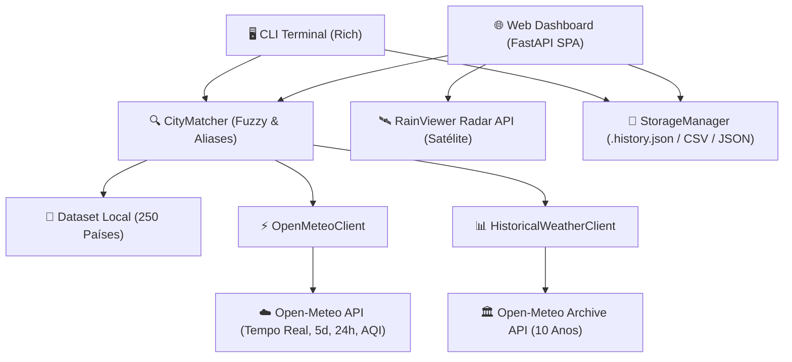

<div align="center">

# 🌤️ Clima Países — World Capitals Weather & Radar

**Dashboard Meteorológico Profissional, Web API REST e CLI para Capitais Mundiais**  
*Cruzando dados geográficos mundiais com as APIs públicas do Open-Meteo e RainViewer com Zero Autenticação.*

---

[](https://github.com/cleiton1231/clima/actions/workflows/ci.yml)


[**Explorar API Docs**](http://localhost:8000/docs) • [**Como Usar**](#-início-rápido) • [**Arquitetura**](#-arquitetura-do-sistema) • [**Docker**](#-execução-via-docker)

---

</div>

## 🌟 Destaques do Projeto

<table>
  <tr>
    <td width="50%">
      <h3>🌍 Matching Inteligente & Multilíngue</h3>
      <ul>
        <li>Busca por <b>capital</b>, <b>país</b> ou <b>código ISO</b> (ex: <code>Brasília</code>, <code>Alemanha</code>, <code>JP</code>, <code>USA</code>).</li>
        <li>Resolução fonética e tolerância a erros de digitação (<i>Fuzzy Matching</i>).</li>
        <li>Normalização de acentuação e pontuação (<code>São Tomé</code> ➔ <code>sao tome</code>, <code>Washington, D.C.</code> ➔ <code>washington dc</code>).</li>
        <li>Sinônimos multilíngues (<code>Viena</code> / <code>Vienna</code>, <code>Pequim</code> / <code>Beijing</code>, <code>Tóquio</code> / <code>Tokyo</code>).</li>
      </ul>
    </td>
    <td width="50%">
      <h3>🛰️ Radar & Análise Histórica</h3>
      <ul>
        <li><b>Radar em Tempo Real:</b> Mapa interativo Leaflet.js com camadas animadas de precipitação (RainViewer API).</li>
        <li><b>Análise Histórica (10 Anos):</b> Comparação da temperatura de hoje com as médias dos últimos 10 a 20 anos na mesma data.</li>
        <li><b>Detecção de Anomalias Térmicas:</b> Cálculo e classificação de desvio térmico (&Delta;T).</li>
      </ul>
    </td>
  </tr>
  <tr>
    <td width="50%">
      <h3>📅 Previsões Estendidas & Qualidade do Ar</h3>
      <ul>
        <li><b>Previsão Diária (5 Dias):</b> Mín/Máx, chuva acumulada, índice UV, nascer e pôr do sol.</li>
        <li><b>Previsão Horária (24h):</b> Temperatura e probabilidade de chuva hora a hora.</li>
        <li><b>Qualidade do Ar (AQI):</b> Índice Europeu, PM2.5, PM10, NO₂ e Ozônio (O₃).</li>
      </ul>
    </td>
    <td width="50%">
      <h3>⚖️ Comparador & Armazenamento</h3>
      <ul>
        <li><b>Comparador Multi-Capitais:</b> Análise térmica simultânea com identificação de extremos e &Delta;T.</li>
        <li><b>Persistência Local:</b> Histórico recente e capitais favoritas salvas.</li>
        <li><b>Exportação de Relatórios:</b> Exportação estruturada para <b>JSON</b> e <b>CSV</b>.</li>
      </ul>
    </td>
  </tr>
</table>

---

## 🏛️ Arquitetura do Sistema



---

## 🚀 Início Rápido

### 1. Pré-requisitos
- Python 3.10 ou superior
- Git

### 2. Instalação Local

```bash
# Clone o repositório
git clone https://github.com/cleiton1231/clima.git
cd clima

# Crie e ative o ambiente virtual
python3 -m venv .venv
source .venv/bin/activate

# Instale as dependências e o comando global 'clima'
pip install -r requirements.txt
pip install -e .
```

---

## 🖥️ Utilizando via Linha de Comando (CLI)

Após a instalação, utilize o comando `clima` diretamente:

```bash
# 1. Abrir Menu Interativo
clima

# 2. Consultar clima atual de uma capital ou país
clima "Brasília"
clima "Tóquio"
clima "Alemanha"

# 3. Dashboard Meteorológico Completo (Tempo Real + 5 Dias + 24h + Qualidade do Ar)
clima "Brasília" --all

# 4. Análise Histórica de 10 Anos & Anomalia Climática
clima "Brasília" --historical

# 5. Previsão Diária (5 Dias) ou Horária (24h)
clima "Paris" --forecast
clima "Paris" --hourly

# 6. Consultar Qualidade do Ar (AQI)
clima "Pequim" --air-quality

# 7. Comparar Múltiplas Capitais Lado a Lado
clima --compare "Brasília" "Tóquio" "Londres" "Roma"

# 8. Exportar Relatório para JSON ou CSV
clima "Brasília" --all --export json --output relatorio_brasilia.json
```

---

## 🌐 Executando a Web API e Dashboard SPA

Inicie o servidor Web local com FastAPI:

```bash
uvicorn src.web.app:app --reload --host 0.0.0.0 --port 8000
```

- 🌍 **Dashboard Web & Radar Interativo**: [`http://localhost:8000`](http://localhost:8000)
- ⚡ **Documentação Interativa (Swagger OpenAPI)**: [`http://localhost:8000/docs`](http://localhost:8000/docs)
- 📖 **Documentação Alternativa (ReDoc)**: [`http://localhost:8000/redoc`](http://localhost:8000/redoc)

### Principais Endpoints da API

| Método | Endpoint | Descrição |
| :--- | :--- | :--- |
| `GET` | `/api/weather/{query}` | Retorna clima atual para uma capital, país ou código ISO. |
| `GET` | `/api/forecast/{query}` | Retorna previsão estendida de 5 dias e 24h horárias. |
| `GET` | `/api/historical/{query}` | Retorna comparação de 10 anos e anomalia climática. |
| `GET` | `/api/radar/layers` | Retorna camadas públicas de satélite e radar de precipitação. |
| `GET` | `/api/air-quality/{query}` | Retorna métricas de qualidade do ar (AQI, PM2.5, PM10, NO₂, O₃). |
| `GET` | `/api/compare?cities=...` | Compara duas ou mais cidades simultaneamente. |
| `GET` | `/api/favorites` | Lista as capitais favoritas salvas. |
| `POST` | `/api/favorites/{query}` | Adiciona ou remove uma capital dos favoritos. |
| `GET` | `/api/history` | Retorna o histórico de consultas recentes. |

---

## 🐳 Execução via Docker

A aplicação inclui um `Dockerfile` otimizado baseado em `python:3.12-slim` com usuário seguro não-root:

```bash
# Construir a imagem Docker
docker build -t clima:latest .

# Executar CLI dentro do container
docker run --rm clima:latest "Brasília" --all
docker run --rm clima:latest "Brasília" --historical

# Executar o Servidor Web e Dashboard no container
docker run --rm -p 8000:8000 --entrypoint uvicorn clima:latest src.web.app:app --host 0.0.0.0 --port 8000
```

---

## 🧪 Testes Automatizados & Qualidade de Código

A suíte de testes unitários e de integração conta com **146 testes automatizados** e cobertura contínua:

```bash
# Executar todos os testes com relatório de cobertura
pytest --cov=src -v
```

---

## 📁 Estrutura de Diretórios

```text
clima/
├── .github/
│   └── workflows/
│       └── ci.yml             # Pipeline de CI (Python 3.10 a 3.13)
├── Dockerfile                 # Imagem containerizada otimizada
├── .dockerignore              # Exclusões de contexto Docker
├── GEMINI.md                  # Governança e regras de arquitetura
├── README.md                  # Documentação do projeto
├── requirements.txt           # Dependências do projeto
├── pyproject.toml             # Manifesto do pacote e scripts CLI
├── pytest.ini                 # Configuração do pytest
├── src/
│   ├── api/
│   │   ├── open_meteo.py         # Cliente Open-Meteo (tempo real, 5d, 24h, AQI)
│   │   ├── historical.py         # Análise histórica e anomalias climáticas
│   │   └── rest_countries.py     # Base de países e capitais
│   ├── data/
│   │   └── countries.json        # Dataset local com 250 países
│   ├── match.py                  # Matching difuso e normalização de texto
│   ├── storage.py                # Persistência de histórico e favoritos
│   ├── comparator.py             # Comparação e análise térmica multi-capitais
│   ├── ui/
│   │   └── views.py              # Visualização rica no terminal (Rich)
│   ├── web/
│   │   ├── app.py                # Servidor Web API FastAPI
│   │   └── static/
│   │       └── index.html        # Dashboard Web SPA com Leaflet e Radar
│   └── main.py                   # Ponto de entrada CLI e menu interativo
└── tests/
    ├── test_match.py             # Testes de matching e normalização
    ├── test_api.py               # Testes de integração Open-Meteo
    ├── test_historical.py        # Testes de análise histórica
    ├── test_security_threats.py  # Testes de segurança STRIDE/OWASP
    ├── test_extended_weather.py  # Testes de previsão 5d e 24h
    ├── test_storage.py           # Testes de storage e variáveis de ambiente
    ├── test_comparator.py        # Testes de comparação de capitais
    ├── test_views.py             # Testes de renderização Rich
    ├── test_cli_entrypoint.py    # Testes do comando executável 'clima'
    ├── test_web_api.py           # Testes da API Web FastAPI
    └── test_main.py              # Testes do fluxo CLI
```

---

## 📄 Licença

Este projeto é disponibilizado sob a licença MIT. Dados meteorológicos cortesia de [Open-Meteo](https://open-meteo.com) e [RainViewer](https://rainviewer.com).
